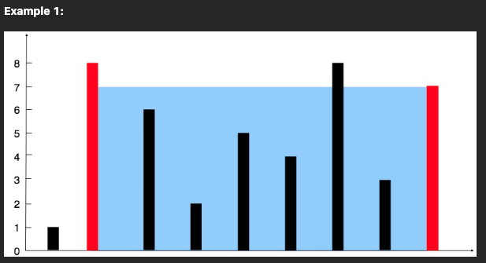

# Container With Most Water

You are given an integer array height of length n. There are n vertical lines drawn such that the two endpoints of the ith line are (i, 0) and (i, height[i]).

Find two lines that together with the x-axis form a container, such that the container contains the most water.

Return the maximum amount of water a container can store.

Notice that you may not slant the container.

## Sample Case

Input: height = [1,8,6,2,5,4,8,3,7]

Output: 49

Explanation: The above vertical lines are represented by array [1,8,6,2,5,4,8,3,7]. In this case, the max area of water (blue section) the container can contain is 49.

Example 2:

Input: height = [1,1]
Output: 1

## Note

> 解題方向

最差的解法就是將每個組合都計算過後回傳最大值  
首先我們將牆面區隔為項目，基準牆、丈量牆。

`最大空間計算：距離 * 高度`

- 距離：基準強 X 軸位置 - 丈量牆 X 軸位置的絕對值
- 高度：基準強高度 與 丈量強高度 的最小值

假設數組：[1,2,1,4]，計算結果如下:

1. 基準牆為 1 的面積組合

| **丈量牆位置** | **距離**    | **高度(基準牆高,丈量牆高)** | **面積** |
| -------------- | ----------- | --------------------------- | -------- |
| 0              | 1 - 1 = [0] | min(1,1) = 1                | 1*0 =0   |
| 1              | 1 - 2 = [1] | min(1,2) = 1                | 1*1 =1   |
| 2              | 1 - 3 = [2] | min(1,1) = 1                | 2*1 =2   |
| 3              | 1 - 4 = [3] | min(1,4) = 1                | 3*1 =1   |

2. 基準牆為 2 的面積組合

| **丈量牆位置** | **距離**    | **高度(基準牆高,丈量牆高)** | **面積** |
| -------------- | ----------- | --------------------------- | -------- |
| 0              | 2 - 1 = [1] | min(2,1) = 1                | 1*1 =1   |
| 1              | 2 - 2 = [0] | min(2,2) = 2                | 0*2 =0   |
| 2              | 2 - 3 = [1] | min(2,1) = 1                | 1*1 =1   |
| 3              | 2 - 4 = [2] | min(2,4) = 2                | 2*2 =4   |

3. 基準牆為 3 的面積組合

| **丈量牆位置** | **距離**    | **高度(基準牆高,丈量牆高)** | **面積** |
| -------------- | ----------- | --------------------------- | -------- |
| 0              | 3 - 1 = [2] | min(1,1) = 1                | 2*1 =2   |
| 1              | 3 - 2 = [1] | min(1,2) = 1                | 1*1 =1   |
| 2              | 3 - 3 = [0] | min(1,1) = 1                | 0*1 =0   |
| 3              | 3 - 4 = [1] | min(1,4) = 1                | 1*1 =1   |

4. 基準牆為 4 的面積組合

| **丈量牆位置** | **距離**    | **高度(基準牆高,丈量牆高)** | **面積** |
| -------------- | ----------- | --------------------------- | -------- |
| 0              | 4 - 1 = [3] | min(4,1) = 1                | 3*1 =3   |
| 1              | 4 - 2 = [2] | min(4,2) = 2                | 2*2 =4   |
| 2              | 4 - 3 = [1] | min(4,1) = 1                | 1*1 =1   |
| 3              | 4 - 4 = [0] | min(4,4) = 4                | 0*4 =0   |

### 如何優化

從左右兩邊開始往中間推擠來計算面積，並以最高的作為基準牆，然後想左右推進丈量牆的位置，直到左邊位置與右強位置重疊結束。

假設數組：[1,2,1,4]，計算結果如下:

左強位置：0
右牆位置：3 (array.length-1)

第一回合：

- 左強位置：0 | 左強高度: 1
- 右牆位置：3 | 右強高度: 4
- 距離: 3-0 = 3
- 面積: min(左強高度,右強高度) \* 距離, 1*3=3

左強比較矮，左牆位置 + 1

第二回合：

- 左強位置：1 | 左強高度: 2
- 右牆位置：3 | 右強高度: 4
- 距離: 3-1 = 2
- 面積: min(左強高度,右強高度) \* 距離, 2*2=4

左強比較矮，左牆位置 + 1

第三回合：

- 左強位置：2 | 左強高度: 1
- 右牆位置：3 | 右強高度: 4
- 距離: 3-2 = 1
- 面積: min(左強高度,右強高度) \* 距離, 1*1=1

左強比較矮，左牆位置 + 1，左右強位置重疊，結束最大值為 4

> 時間複雜度

> Edge Case