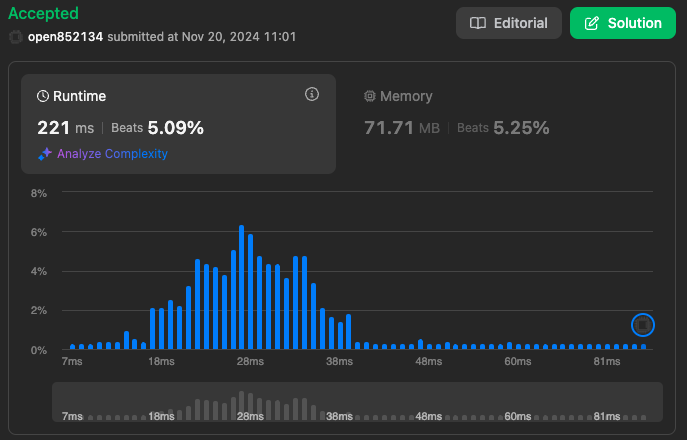

# 2390. Removing Stars From a String

You are given a string s, which contains stars *.

In one operation, you can:

Choose a star in s.
Remove the closest non-star character to its left, as well as remove the star itself.
Return the string after all stars have been removed.

Note:

The input will be generated such that the operation is always possible.
It can be shown that the resulting string will always be unique.

## Sample Case

Example 1:

```plaintext
Input: s = "leet**cod*e"
Output: "lecoe"
Explanation: Performing the removals from left to right:
- The closest character to the 1st star is 't' in "leet**cod*e". s becomes "lee*cod*e".
- The closest character to the 2nd star is 'e' in "lee*cod*e". s becomes "lecod*e".
- The closest character to the 3rd star is 'd' in "lecod*e". s becomes "lecoe".
There are no more stars, so we return "lecoe".
```

Example 2:

```plaintext
Input: s = "erase*****"
Output: ""
Explanation: The entire string is removed, so we return an empty string.
```

## Note

> Solution

直接跑 reduce 然後判斷 start 並移除前一個項目，再回傳最後結果，但這樣的做法速度超慢 🤣

```javascript
/**
 * @param {string} s
 * @return {string}
 */
var removeStars = function (s) {
  return s.split("").reduce((accumulator, currentValue) => {
    if (currentValue === "*") {
      return accumulator.slice(0, -1);
    }

    return accumulator + currentValue;
  }, "");
};
```

更接近 stack 的操作方式

```javascript
const result = [];

  s.split("").forEach((value) => {
    if (value === "*") {
      result.pop();
    } else {
      result.push(value);
    }
  });

  return result.join("");
```



### 如何優化

看了其他 Leetcode 上的 Solution 前面跑比較快的寫法, 都是從後面開始處理減少了還要 pop 的這個動作。

`erase*****` 以這為例，從後面開始執行，然後計算要刪除幾個 item，如果要刪除的 item 數量 `> 0`，就不會組合回傳字串

- index: 10
  - 遇到 `*` 號 Should Remove Item : 0+1 = 1
  - 回傳字串 = '' (Should Remove Item > 0 不做事)

- index: 9
  - 遇到 `*` 號 Should Remove Item : 0+1 = 2
  - 回傳字串 = '' (Should Remove Item > 0 不做事)

- index: 8
  - 遇到 `*` 號 Should Remove Item : 0+1 = 3
  - 回傳字串 = '' (Should Remove Item > 0 不做事)

- index: 7
  - 遇到 `*` 號 Should Remove Item : 0+1 = 4
  - 回傳字串 = '' (Should Remove Item > 0 不做事)

- index: 6
  - 遇到 `*` 號 Should Remove Item : 0+1 = 5
  - 回傳字串 = '' (Should Remove Item > 0 不做事)

- index: 5
  - 遇到 `字母` 號 Should Remove Item : 5-1 =0
  - 回傳字串 = '' (Should Remove Item > 0 不做事)

以此類推

> Time complexity

O(n)

> Edge Case

amount of * equals to amount of characters, return ""
